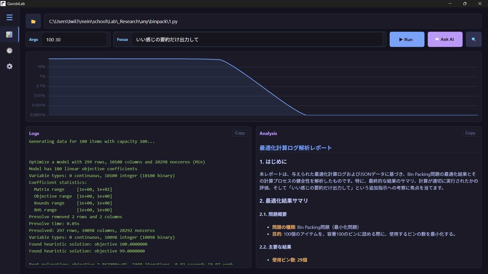
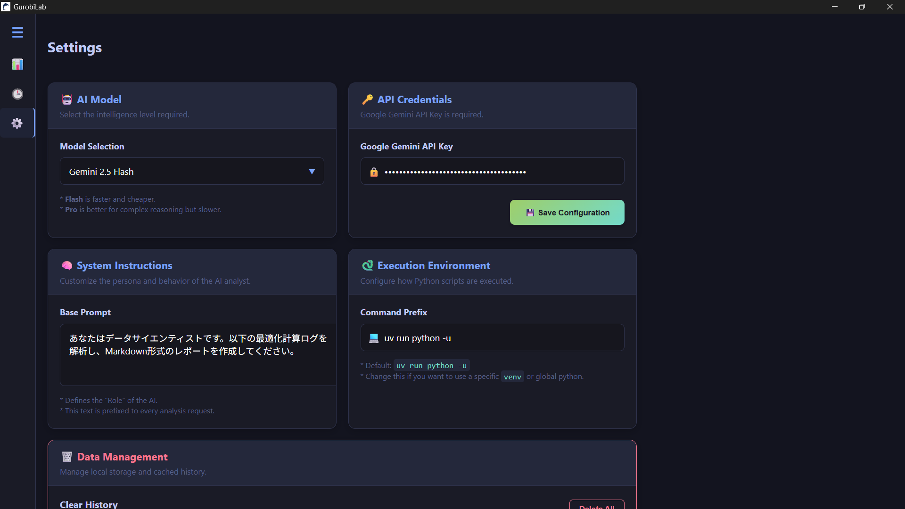
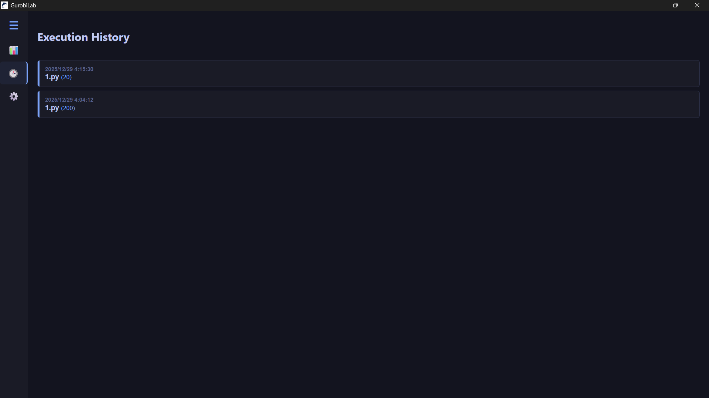

# GurobiLab Desktop

<div align="center">
  
</div>

<br>

**GurobiLab Desktop** は、Gurobi Optimizer による数理最適化計算を実行・監視し、そのログを AI (Google Gemini) を用いて解析するためのデスクトップアプリケーションです。
Rust (Tauri) と TypeScript (Svelte) で構築されており、高速かつモダンなUIを提供します。

## ✨ 特徴 (Features)

- **最適化実行環境:** Pythonスクリプト (`.py`) をドラッグ＆ドロップで読み込み、GUIから実行。
- **リアルタイム可視化:** 最適化のログ（Gap, Objective Value）をリアルタイムにグラフ描画（対数スケール対応）。
- **AIログ解析:** Google Gemini (2.5 Flash / Pro 等) を利用し、計算結果やログの健全性を自動でレポート化。
    - 数式 (LaTeX) のレンダリング対応。
    - システムプロンプト（AIの人格）のカスタマイズが可能。
- **実行履歴管理:** 過去の実行結果、ログ、解析レポートを自動保存。
- **柔軟な設定:**
    - 実行コマンドのカスタマイズ (例: `uv run python -u`, `venv` 等)。
    - モデル選択機能。
    - 履歴の一括削除。

## 📸 スクリーンショット (Screenshots)

### Dashboard

最適化の実行状況をグラフとログでリアルタイムに確認できます。


<br>

### Settings

AIモデルの選択、システムプロンプトの編集、実行コマンドの設定などが可能です。


<br>

### History

過去の実行履歴をリスト表示し、いつでも解析結果を振り返ることができます。


## 🚀 セットアップ (Installation)

### 前提条件 (Prerequisites)

- **Node.js** & **Bun** (パッケージマネージャ)
- **Rust** (Cargo)
- **Python** & **Gurobi Optimizer** (ライセンス含む)
    - 推奨: [uv](https://github.com/astral-sh/uv) によるPython環境管理

### ビルド手順

1.  リポジトリをクローンします。

    ```bash
    git clone [https://github.com/your-username/GurobiLab-Desktop.git](https://github.com/your-username/GurobiLab-Desktop.git)
    cd GurobiLab-Desktop
    ```

2.  依存パッケージをインストールします。

    ```bash
    bun install
    ```

3.  開発モードで起動します。

    ```bash
    bun tauri dev
    ```

4.  プロダクションビルド（exe生成）を行う場合:
    ```bash
    bun tauri build
    ```

## ⚙️ 使い方 (Usage)

1.  **APIキーの設定:**
    - アプリ起動後、サイドバーの `Settings` を開き、Google Gemini API Key を入力・保存します。
2.  **実行環境の設定:**
    - `Execution Environment` にて、普段ご使用のPython実行コマンドを設定します。
    - デフォルト: `uv run python -u`
    - ※ Windowsでパスが通っていない場合や `venv` を使う場合はフルパスで指定してください。
3.  **スクリプトの実行:**
    - `Run` タブで `.py` ファイルを選択し、必要であれば引数 (Args) を入力して `▶ Run` をクリックします。
4.  **AI解析:**
    - 計算終了後（または停止後）、`💬 Ask AI` ボタンを押すと、ログに基づいた解析レポートが生成されます。

## 🛠️ 技術スタック (Tech Stack)

- **Frontend:** Svelte, TypeScript, Chart.js, KaTeX
- **Backend:** Rust (Tauri v2)
- **AI:** Google Gemini API

## 📜 ライセンス (License)

[MIT](./LICENSE)
